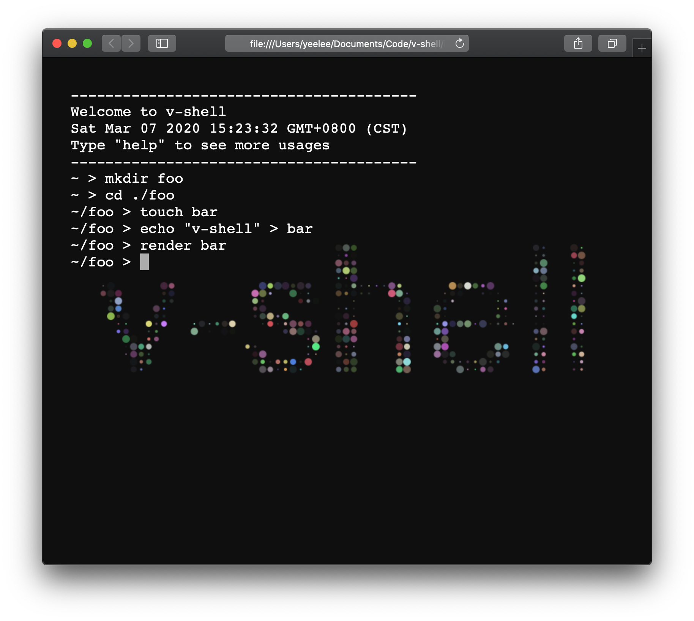

# v-shell

## Intro
It's a web terminal toy based on pure Typescript without any dependencies

## Basic command :
* ls [path]
* cd [path]
* mkdir [path]
* rm [-r] [path]
* cat [file]
* echo [str]
* help
* touch [file]
* clear
* render [file]

## Demo

## Todo 
* syntax parse
* pipeline
